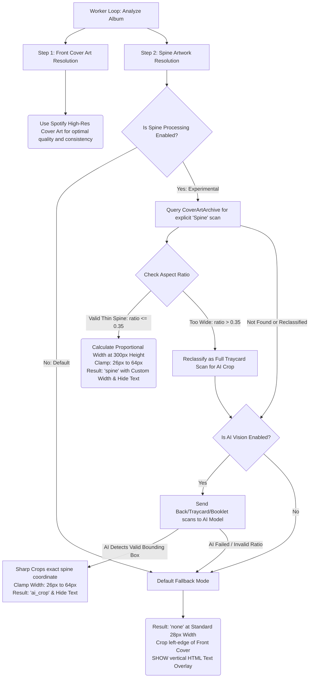

# CD Music Display

> ⚠️ **Disclaimer:** This project was entirely "vibe coded" by an AI agent (Google Antigravity). It is experimental!

> An ultra-wide, touch-first, self-hosted physical CD shelf UI for your Spotify library. Dockerised and designed specifically for long, wide hardware displays like a wall-mounted marquee.


## Features

- 🎵 **Spotify Integration**: Connect your entire Spotify library and control playback via the Spotify Web API.
- 📀 **Physical CD Rack UI**: Browse your albums as a continuous, swipeable rack of physical CD spines.
- 🎛️ **Glassmorphic Controls**: Tap any album to bring it front-and-center. A slick, auto-hiding glass overlay provides play controls and a global mini-player.
- 📱 **Spotify Connect Ready**: Pick which of your physical Spotify Connect devices (Sonos, Echo, Desktop) to play music out of directly from the UI.
- ⚙️ **On-Screen Settings**: A full-screen overlay for changing themes, sort orders, and managing API keys without needing an external app.
- 🖥️ **Ultra-Wide Optimised**: Custom engineered specifically for displays that are very wide but not very tall.
- 🐳 **Docker Deployment**: One-command setup.

## Screenshots


## Quick Start (Docker)

1. Clone the repository:
   ```bash
   git clone https://github.com/Adman1020/CD-Music-Display.git
   cd CD-Music-Display
   ```
2. Start the application using Docker Compose:
   ```bash
   docker compose up -d
   ```
3. Open [http://localhost:3000](http://localhost:3000) in your browser.
4. Follow the on-screen setup wizard to configure your Spotify credentials and log in.

## Spotify Developer Setup

Because this app acts as a remote control for your Spotify account, you must create a personal Spotify Developer App.

1. Go to the [Spotify Developer Dashboard](https://developer.spotify.com/dashboard) and log in.
2. Click on **Create app**.
3. Set your App name and App description to whatever you like.
4. Add the following **Redirect URI**: `http://127.0.0.1:3000/auth/callback` (or `http://localhost:3000/auth/callback` if testing locally, or your specific IP address if accessing over the network).
5. Ensure you check **Web API** and **Web Playback SDK** in the APIs/Permissions section.
6. Copy your **Client ID** and **Client Secret** and enter them into the app's setup screen in your browser.
7. **Note:** A Spotify Premium account is required for full playback control and Connect features.

## Architecture

- **Backend:** Express.js (Node.js) serving a REST API and managing Spotify OAuth securely.
- **Frontend:** Vanilla JavaScript, HTML5, and CSS3. Zero heavy frameworks.
- **Database:** SQLite (via `better-sqlite3`) to securely store your configuration, access tokens, and cached album art.
- **APIs:** Spotify Web API, Cover Art Archive, MusicBrainz, + AI Vision models (optional)

## Artwork Engine & Variable-Width Shelf

To recreate the realism of a physical CD rack, the background worker server uses a multi-tiered pipeline that independently resolves **Front Cover Art** and **Spine Artwork** for every album in your Spotify library.

### Pipeline Workflow Diagram



### Key Technical Details

#### 1. Consistent High-Res Front Covers & CD Format Protection
* Front cover art is strictly sourced from Spotify's official high-resolution album imagery to guarantee vibrant visual consistency across your catalog without uneven scanner borders or brightness artifacts.
* When scanning MusicBrainz and the Cover Art Archive for CD spines, queries explicitly append `AND format:CD` to ensure we never accidentally import vinyl gatefold or audio cassette packaging dimensions.

#### 2. Realistic Width Clamping & Variable-Width CD Spines
* On a physical shelf, standard single jewel cases are around ~28px wide, while double albums ("fatboxes") or deluxe digipaks are thicker (up to ~64px). To prevent distorted "needle-thin" or excessively wide scans, dimensions are strictly clamped to a realistic **26px to 64px** range.
* Whenever a candidate scan is found on Cover Art Archive tagged as `Spine`, our server-side `sharp` image processing engine checks its geometry. Because uploaders frequently tag full unfolded back traycard scans as `Spine`, the server enforces an **Aspect Ratio Gatekeeper**: any image whose width is greater than 35% of its height is rejected as a direct spine and automatically forwarded to AI Vision to crop out the true spine flap!
* Validated spine dimensions are proportionally calculated when scaled to a 300px shelf height:
  $$\text{Target Width} = \min\left(64, \max\left(26, \text{round}\left(300 \times \frac{\text{original width}}{\text{original height}}\right)\right)\right)$$

#### 3. Interactive Toggleable Pop-Out Box & Sequential Animation
* Clicking any CD spine smoothly scrolls it to the center of the screen first, waiting until the album arrives in the middle before activating a smooth 3D jewel-case pop-out animation without any cover art flickering.
* A clean SVG minimize icon in the top right corner of the glassmorphic controls overlay allows you to fold the album away directly back into its native spine width on the rack, with adjacent CDs seamlessly sliding together to close up any empty gaps.

#### 4. Authentic Text Overlay Logic & Persistent Volume Storage
* Whenever a real scan is discovered (either an explicit Cover Art Archive spine or an AI-cropped inlay), the UI automatically hides the HTML vertical font overlay so you can appreciate the original typography printed on the CD artwork.
* The vertical text overlay is only displayed when utilizing the default left-edge slice of the album cover art.
* All generated spine image crops and database state are securely stored inside the persistent Docker `/data` volume, ensuring configurations and cached scans survive container upgrades and rebuilds.

---

## CD Spine Extraction & AI Vision (Experimental)

By default, **Spine Image Processing is disabled** to ensure visual perfection across your shelf using crisp, reliable slices of Spotify album artwork. Because crowdsourced archive imagery from Cover Art Archive can sometimes feature uneven lighting, misaligned text, or incomplete traycard scans, spine extraction is treated as an **Experimental Feature**.

You can enable **Spine Image Processing (AI & Heuristics)** at any time inside the UI Settings:
- When enabled, the server uses a **Heuristics Pipeline** to sanitize album titles (removing suffixes like "(Remastered)" or "(Deluxe Edition)") and query Cover Art Archive for explicit `Spine` tagged scans.
- If an explicit spine is absent, you can also toggle **Use AI Vision**:
  - The background worker downloads candidate scans (back covers, traycards, booklets) and sends them to a multimodal vision model (Gemini, OpenAI, or Claude) to identify the precise bounding box of the spine flap, which is physically cropped via `sharp` and saved locally to `/data`.
  - **Rate Limits:** To prevent unexpected API usage bills or rate throttling, configure a courteous rate limit in settings (defaulting to 1 request per minute). 
  - **Live Diagnostics:** Monitor the background extraction engine in real-time by clicking "View AI Worker Logs & Status" inside settings!
  - **Instant Reset:** Disabling the toggle automatically wipes experimental spine records and cleanly reverts your entire library to standard Spotify slices within seconds.

### Recommended AI Models
> *Note: Since extracting a spine requires precise spatial reasoning (identifying a bounding box and outputting strict JSON coordinates), we recommend using flagship or highly capable multimodal models.*

1. **Google Gemini**
   - **`gemini-2.5-flash`** *(Recommended)*: Excellent speed, cost, and spatial vision accuracy. Typically offers generous daily request quotas on Google AI Studio Free Tier (up to 1,500 requests/day).
   - **`gemini-3.0-flash`** / **`gemini-1.5-pro`**: Powerful multimodal alternatives. *(Note: brand new experimental/preview flash models like `gemini-3.6-flash` often carry strict daily 20-request caps on free tier accounts unless pay-as-you-go billing is enabled).*
2. **Anthropic Claude**
   - **`claude-3-5-sonnet-20240620`** *(Recommended)*: Anthropic's sweet-spot model. Outstanding at deciphering cluttered CD back-cover scans.
3. **OpenAI**
   - **`gpt-4o`** *(Recommended)*: The current multimodal flagship. Very fast and accurate for visual JSON coordinate extraction.
   - **`gpt-4o-mini`**: Highly cost-effective if processing a massive CD library.

## License

This project is licensed under the [MIT License](LICENSE).
